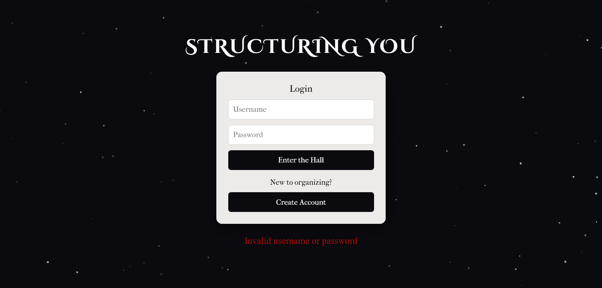
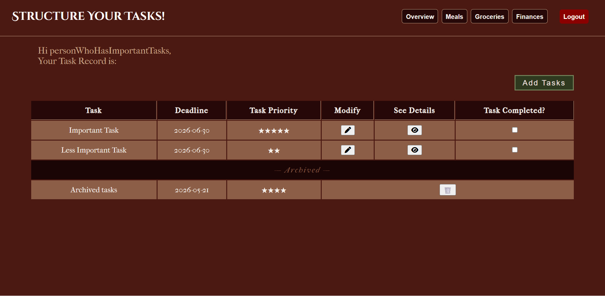
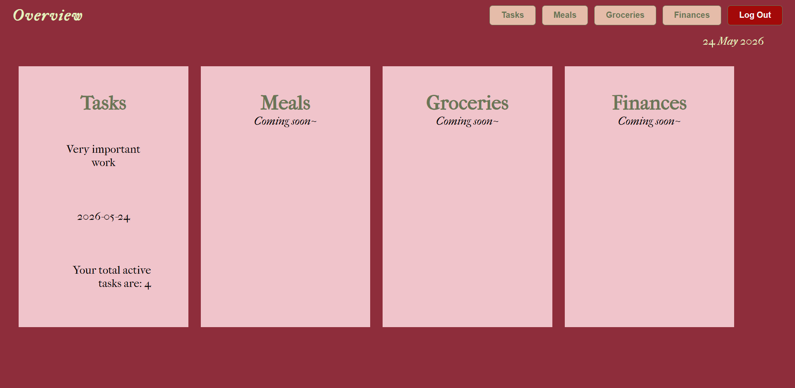

# StructuringYou

A personal organization web app built using Flask and MySQL to help users manage tasks, stay organized, and plan daily life.

---

# ✨ Features

## 🔐 Authentication
- User signup and login system
- Secure password hashing using Werkzeug
- Session-based authentication

---

## ✅ Tasks Module
- Add, edit, and delete tasks
- Star-based priority picker (1–5)
- Deadline tracking
- Archive completed tasks
- Sort tasks by priority and deadline
- View task details in popup modal

---

## 📊 Dashboard / Overview
- Summary card displaying most urgent active task
- Total active task count
- Current date display

---

# 📸 Screenshots







---

# 🚧 Planned Features

- 🍽️ Meal Planner
- 🛒 Grocery List Generator
- 💰 Finance Tracker

---

# 🛠️ Tech Stack

## Backend
- Python
- Flask

## Database
- MySQL
- Flask-MySQLDB

## Frontend
- HTML
- CSS
- JavaScript
- Jinja2

## Authentication
- Werkzeug password hashing
- Flask sessions

## Fonts
- Cinzel Decorative
- IM Fell French Canon

---

# 🚀 Running Locally

## Prerequisites

Make sure you have installed:

- Python 3.x
- MySQL
- pip

---

## 1. Clone the Repository

```bash
git clone https://github.com/yourusername/structuring-you.git
cd structuring-you
```

---

## 2. Create Virtual Environment

```bash
python -m venv venv
```

### Activate Environment

#### Windows
```bash
venv\Scripts\activate
```

#### Mac/Linux
```bash
source venv/bin/activate
```

---

## 3. Install Dependencies

```bash
pip install -r requirements.txt
```

---

# 🗄️ Database Setup

Create a MySQL database named:

```sql
structuring
```

Then run:

```sql
CREATE TABLE users (
    user_id INT PRIMARY KEY AUTO_INCREMENT,
    user_name VARCHAR(50) UNIQUE NOT NULL,
    email VARCHAR(50) NOT NULL,
    password VARCHAR(255) NOT NULL,
    created_at DATETIME DEFAULT CURRENT_TIMESTAMP
);

CREATE TABLE userTasks (
    taskID INT PRIMARY KEY AUTO_INCREMENT,
    userID INT NOT NULL,
    taskTitle VARCHAR(200) NOT NULL,
    taskDesc VARCHAR(500),
    deadline DATETIME,
    priority INT DEFAULT 1,
    isCompleted BOOLEAN DEFAULT FALSE,
    isArchived BOOLEAN DEFAULT FALSE,
    createdAt DATETIME DEFAULT CURRENT_TIMESTAMP,
    FOREIGN KEY(userID) REFERENCES users(user_id)
);
```

---

# ⚙️ Configuration

Edit `config.py` with your MySQL credentials:

```python
class Config:
    MYSQL_HOST = 'localhost'
    MYSQL_USER = 'root'
    MYSQL_PASSWORD = 'your_password'
    MYSQL_DB = 'structuring'
    MYSQL_CURSORCLASS = 'DictCursor'
    MYSQL_AUTOCOMMIT = True

    SECRET_KEY = 'your_secret_key'
```

---

# ▶️ Run the App

```bash
python app.py
```

Open in browser:

```text
http://127.0.0.1:5000
```

---

# 📁 Project Structure

```text
structuring-you/
├── app.py
├── config.py
├── requirements.txt
├── templates/
│   ├── userlogin.html
│   ├── signup.html
│   ├── dashboard.html
│   └── tasks.html
└── static/
```

---

# 🌙 About the Project

StructuringYou was created as a personal productivity and life-management project focused on combining organization with a visually atmospheric interface. The project is still actively being developed with more modules planned in the future.